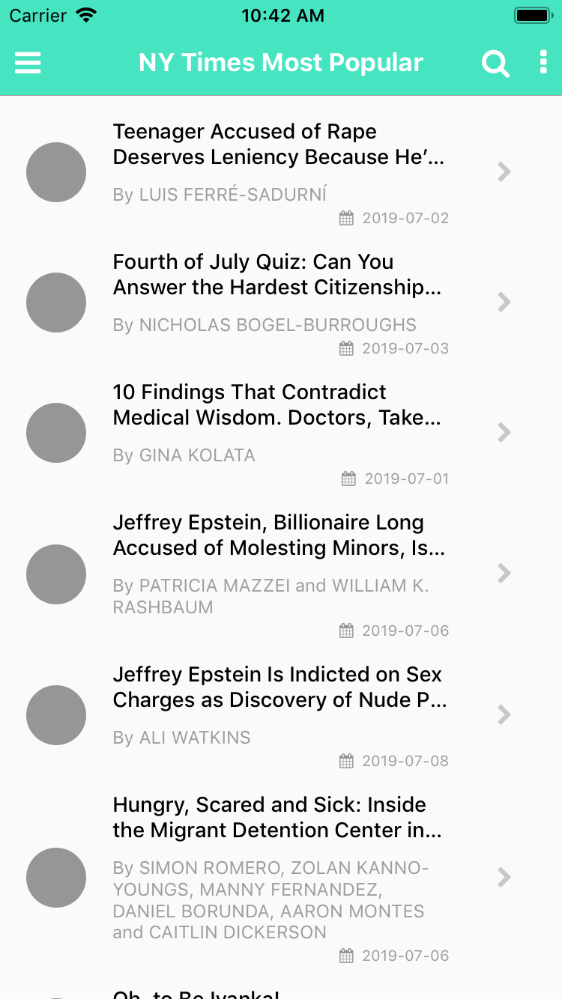
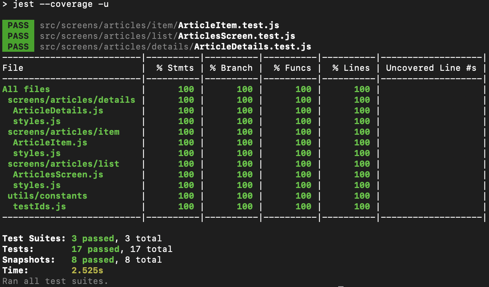
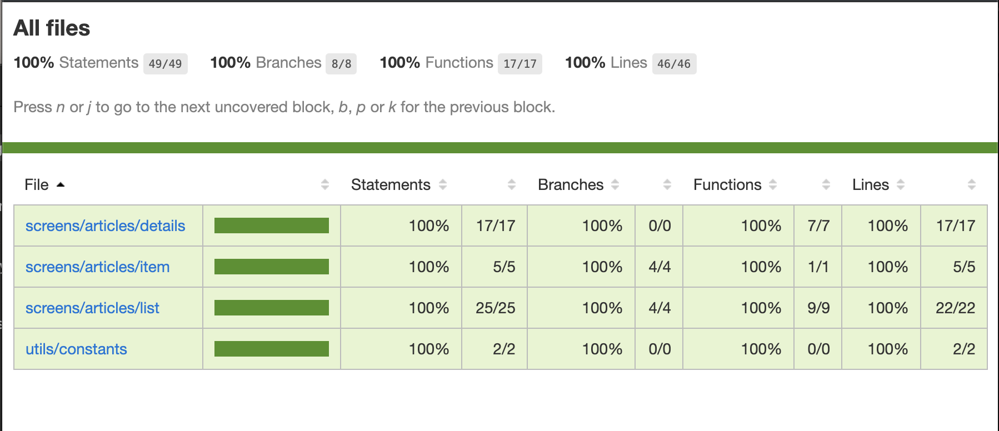

# NYTimes Most Popular
[The New York Times](http://nytimes.com) reader mobile app, made with [React Native](https://facebook.github.io/react-native/).




## Features / Components
- Uses `React 16.8.3`
- Uses `React Native 0.59.8`
- Displays most popular articles from NY Times

## Development

### Folder structure
Application is structured by features along with their unit test cases. 
- Articles have a listing page which contains each listing cell item component and it's unit test cases
- Articles has it's detail page along with the test cases structured in a similar manner

### Usage of frameworks
- react-navigation-v3 which is extremely popular solution for navigating between screens
- react-native-webview starting v0.60 of react native webview has been moved outside to react native community
- react-native-vector-icons which simplifies using icons which a variety of icon collection
- jest, enzyme and react-dom to facilitate unit testing

### Getting started
Clone or download the repository, cd to the folder and follow the below steps 
```
$ npm install 
$ react-native link
$ react-native run-ios
$ react-native run-android
```
Read more about linking libraries manually here [Linking iOS](https://facebook.github.io/react-native/docs/linking-libraries-ios)

### Scripts
- `$ npm start` - Starts the react native package manager
- `$ npm test` - Executes tests and prepares code coverage report
- `$ npm run lint` - Lints the code using ESLint with the popular airbnb config

## Testing
The project currently contains unit-tests for the components, at same path with name suffixed `.test.js`.

Run `npm test` to execute these tests. This will generate a `coverage report` under coverage folder. To view this report open coverage -> lcov-report and click on `index.html`.


### Unit Test Coverage Report





## Author
- [@rishabhbhatia](https://github.com/rishabhbhatia)
